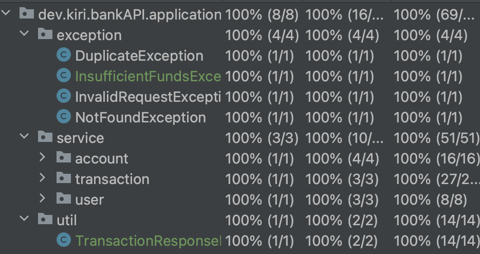

## Application Architecture
Using the **Hexagonal Architecture** where we can find the following directories:
- `adapter`
  - `controller`: REST Controllers
  - `persistence`: Database Interactions (in our case with Spring Data JPA)
- `application`
  - `service`: Application business logic
  - `exception`: Custom Exceptions
- `configuration`: Configuration classes
- `domain`: Domain Entities

## REST API endpoints
- `POST /api/v1/users`: Register new user ✅
- `GET /api/v1/users/{userId}`: Get user by id ✅
- `POST /api/v1/accounts`: Create new account (wallets) ✅
- `POST /api/v1/accounts/{accountId}/deposit`: Deposit money into an account ✅
- `GET /api/v1/accounts/{accountId}`: View account balance ✅
- `GET /api/v1/transactions/account/{accountId}`: View account movements (transactions) ✅
- `POST /api/v1/transactions`: Transfer money from one account to another ✅

## Testing
- Unit tests for the application business logic coverage 100% ✅

- Integration tests for the controllers to simulate a successful transaction ✅
